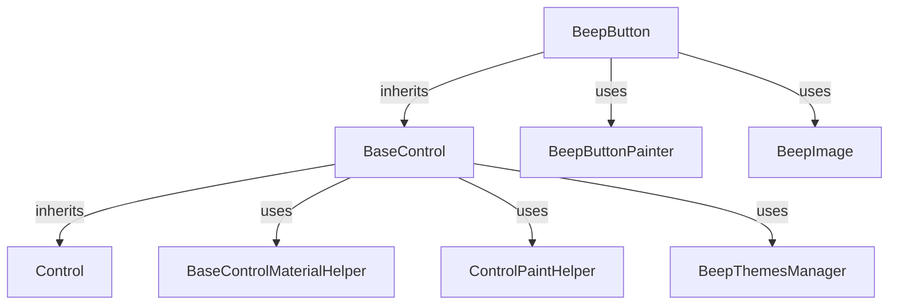

# Claude-Specific Instructions for Beep.Winform

This document provides Claude-specific guidance for working with the Beep.Winform WinForms control library. Claude excels at deep reasoning, comprehensive documentation, and complex refactoring tasks. For general project guidelines, see [copilot-instructions.md](copilot-instructions.md). For Cursor IDE-specific guidance, see [cursor-instructions.md](cursor-instructions.md).

## Table of Contents

- [Reasoning Patterns](#reasoning-patterns)
- [Long-Form Code Generation](#long-form-code-generation)
- [Documentation Generation](#documentation-generation)
- [Complex Refactoring](#complex-refactoring)
- [Architecture Analysis](#architecture-analysis)
- [Best Practices](#best-practices)
- [Quick Reference](#quick-reference)

## Reasoning Patterns

### Understanding Before Implementing

Claude's strength lies in deep understanding before making changes. When working with Beep.Winform:

1. **Architectural Analysis First**: Before modifying any control, understand:
   - The inheritance hierarchy (BaseControl → specific control)
   - How the control fits into the overall architecture
   - Dependencies and relationships with other components
   - Theme integration points
   - Paint pipeline interactions

2. **Multi-Step Reasoning**: Break complex tasks into reasoning steps:
   ```
   Step 1: Understand the requirement
   Step 2: Identify affected components
   Step 3: Analyze dependencies and side effects
   Step 4: Design the solution
   Step 5: Implement with proper error handling
   Step 6: Consider edge cases and performance
   Step 7: Update documentation
   ```

3. **Pattern Recognition**: Claude should identify and explain patterns:
   - Painter Strategy Pattern usage
   - Material Design integration patterns
   - Theme propagation patterns
   - DPI scaling patterns
   - Hit-testing patterns

### Example Reasoning Workflow

**Task**: "Add a new animation effect to BeepButton"

**Claude's Reasoning Process**:

1. **Understand Current State**:
   - Examine BeepButton's current animation system
   - Identify where animations are handled (BaseControl? BeepButton-specific?)
   - Review existing animation patterns (ripple, pulse, etc.)

2. **Identify Integration Points**:
   - Where should the animation trigger? (Mouse events, property changes, etc.)
   - How does it interact with existing animations?
   - Does it need theme integration?

3. **Design Solution**:
   - Should it use the existing animation infrastructure?
   - Does it need new properties/methods?
   - How does it affect performance?

4. **Consider Side Effects**:
   - Will it conflict with other animations?
   - Does it need to be disabled in certain states?
   - How does it interact with Material Design?

5. **Implementation Plan**:
   - Code changes needed
   - Documentation updates required
   - Testing considerations

## Long-Form Code Generation

### Comprehensive Control Creation

When creating a new control, Claude should generate complete, production-ready code:

#### 1. Complete Class Structure

Generate all necessary components in a single response:

```csharp
// Main control class
public partial class BeepNewControl : BaseControl
{
    // Properties
    // Fields
    // Constructors
    // Core methods (DrawContent, ApplyTheme, etc.)
}

// Partial class for events (if needed)
public partial class BeepNewControl
{
    // Event handlers
}

// Partial class for layout (if needed)
public partial class BeepNewControl
{
    // Layout calculations
}

// Painter class (if using Strategy pattern)
public class BeepNewControlPainter : IBeepUIComponent
{
    // Rendering logic
}
```

#### 2. Include All Required Elements

- **Theme Integration**: Complete `ApplyTheme()` method
- **Layout Calculations**: `CalculateLayout()` method using `DrawingRect`
- **Hit-Testing**: Proper `AddHitArea()` calls
- **DPI Scaling**: Use `ScaleValue`, `GetScaledFont` helpers
- **Resource Management**: Proper `IDisposable` implementation if needed
- **Error Handling**: Try-catch blocks for design-time safety

#### 3. Documentation Generation

Generate comprehensive documentation alongside code:

- XML comments for public APIs
- Inline comments explaining complex logic
- README.md updates
- Usage examples

### Code Generation Best Practices

1. **Generate Complete Solutions**: Don't leave TODOs or placeholders
2. **Follow Project Patterns**: Match existing control implementations
3. **Include Error Handling**: Design-time guards, null checks, etc.
4. **Performance Considerations**: Avoid allocations in paint methods
5. **Theme Awareness**: Always include theme integration

## Documentation Generation

### Comprehensive Documentation Strategy

Claude excels at creating thorough, well-structured documentation:

#### 1. README.md Structure

When creating/updating README files, include:

- **Overview**: What the control does and its purpose
- **Architecture**: How it fits into the BaseControl hierarchy
- **Key Features**: List of capabilities
- **Usage Examples**: Code samples showing common use cases
- **Properties**: Documented property list with descriptions
- **Methods**: Public method documentation
- **Theme Integration**: How theming works
- **Performance Notes**: Important performance considerations
- **Troubleshooting**: Common issues and solutions

#### 2. XML Documentation Comments

Generate complete XML documentation:

```csharp
/// <summary>
/// Gets or sets the value displayed in the control.
/// </summary>
/// <value>
/// The value to display. Can be null.
/// </value>
/// <remarks>
/// This property is theme-aware and will update the display
/// when the theme changes. The value is rendered using the
/// current ForeColor from the theme.
/// </remarks>
public object Value { get; set; }
```

#### 3. Architecture Documentation

When documenting architecture decisions:

- **Why**: Explain the reasoning behind design choices
- **Alternatives**: Mention considered alternatives and why they weren't chosen
- **Trade-offs**: Discuss performance, maintainability, complexity trade-offs
- **Future Considerations**: Note potential future improvements

### Documentation Update Triggers

Claude should proactively update documentation when:

- Adding new public properties/methods
- Changing control behavior
- Modifying theme integration
- Updating layout logic
- Adding new dependencies
- Changing inheritance hierarchy
- Fixing bugs that reveal documentation gaps

## Complex Refactoring

### Multi-File Refactoring Strategy

Claude's ability to understand complex relationships makes it ideal for refactoring:

#### 1. Impact Analysis

Before refactoring, Claude should:

- **Identify All Affected Files**: Use semantic search to find all usages
- **Understand Dependencies**: Map out how changes propagate
- **Check Overrides**: Identify methods that are overridden in derived classes
- **Consider Side Effects**: Think about unintended consequences

#### 2. Refactoring Safety Rules

**Critical Rules**:

1. **Never Modify Paint Methods During Refactoring**: Paint methods (`OnPaint`, `DrawContent`) must remain read-only - no state changes
2. **Preserve Virtual Methods**: Don't remove `virtual` keywords without checking all overrides
3. **Maintain Theme Integration**: Ensure `ApplyTheme()` still works correctly
4. **Update Documentation**: README files must reflect changes
5. **Test Compatibility**: Consider impact on existing controls

#### 3. Refactoring Patterns

**Extracting Common Functionality**:

When extracting shared code from multiple controls:

1. Identify the common pattern
2. Create a helper class or base method
3. Update all controls to use the shared code
4. Ensure theme integration is preserved
5. Update documentation

**Example**: Extracting common layout calculation pattern:

```csharp
// Before: Repeated in multiple controls
private void CalculateLayout()
{
    var baseRect = DrawingRect;
    int padding = ScaleValue(8);
    // ... control-specific logic
}

// After: Shared helper in BaseControl or helper class
protected virtual void CalculateStandardLayout(Rectangle baseRect, int padding, out Rectangle contentRect)
{
    // Common layout logic
}
```

**Consolidating Theme Application**:

When refactoring theme application:

1. Identify common theme property assignments
2. Create helper methods in BaseControl or BeepThemesManager
3. Update all `ApplyTheme()` implementations
4. Ensure backward compatibility

### Refactoring Checklist

Before completing a refactoring:

- [ ] All affected files identified and updated
- [ ] No paint cycle violations introduced
- [ ] Theme integration preserved
- [ ] Documentation updated
- [ ] No breaking changes to public API (unless intentional)
- [ ] Performance impact considered
- [ ] Edge cases handled

## Architecture Analysis

### Deep Understanding of BaseControl

Claude should provide comprehensive analysis of architecture:

#### 1. Inheritance Hierarchy Analysis

When analyzing the control hierarchy:

- Map out the inheritance chain
- Identify virtual methods and their overrides
- Understand the responsibility of each level
- Explain how methods flow through the hierarchy

#### 2. Pattern Recognition

Identify and explain architectural patterns:

- **Strategy Pattern**: Painter classes for rendering
- **Template Method**: BaseControl's paint pipeline
- **Observer Pattern**: Theme change notifications
- **Factory Pattern**: Control creation helpers

#### 3. Design Decision Explanations

When explaining design decisions:

- **Why BaseControl exists**: Centralized paint pipeline, DPI handling, theme integration
- **Why Painter Pattern**: Separation of rendering logic, testability, flexibility
- **Why Material Design Integration**: Consistency, modern UI, accessibility
- **Why DrawingRect vs ClientRectangle**: Material-aware layout, proper padding handling

### Architecture Documentation Generation

When documenting architecture:

1. **Visual Diagrams**: Use mermaid diagrams to show relationships
2. **Flow Charts**: Document paint pipeline, event flow
3. **Class Diagrams**: Show inheritance and composition
4. **Sequence Diagrams**: Document interaction patterns

Example architecture explanation:



## Best Practices

### Code Quality Standards

1. **Comprehensive Error Handling**:
   - Design-time guards: `if (DesignMode) return;`
   - Null checks for external dependencies
   - Try-catch blocks for graphics operations
   - Graceful degradation when themes unavailable

2. **Performance Optimization**:
   - Avoid allocations in paint methods
   - Cache calculated values (fonts, rectangles)
   - Use `StringBuilder` for string concatenation in loops
   - Dispose graphics resources properly

3. **Memory Management**:
   - Implement `IDisposable` when holding unmanaged resources
   - Dispose child controls and images properly
   - Clear event handlers to prevent leaks
   - Use `using` statements for temporary resources

4. **Code Organization**:
   - Use partial classes for large controls
   - Group related functionality together
   - Keep methods focused and single-purpose
   - Extract complex logic into helper methods

### Claude-Specific Workflows

#### 1. Multi-Step Feature Development

When implementing complex features:

**Step 1: Research and Analysis**
- Search codebase for similar implementations
- Understand existing patterns
- Identify integration points

**Step 2: Design**
- Plan the implementation approach
- Identify required changes
- Consider edge cases

**Step 3: Implementation**
- Generate complete, working code
- Include error handling
- Follow project patterns

**Step 4: Integration**
- Update theme integration
- Add hit-testing if interactive
- Update documentation

**Step 5: Review**
- Check for paint cycle violations
- Verify performance impact
- Ensure consistency with existing code

#### 2. Documentation-First Approach

For new features or significant changes:

1. **Write Documentation First**: Define the API and behavior
2. **Generate Code to Match**: Implement according to documentation
3. **Update as Needed**: Keep documentation in sync with implementation

#### 3. Explain Complex Logic

Claude should provide explanations for:

- Why certain patterns are used
- How components interact
- Performance considerations
- Trade-offs in design decisions

### Communication Style

When working with Claude on Beep.Winform:

1. **Be Explicit**: Provide clear requirements and context
2. **Ask for Explanations**: Request architectural analysis when needed
3. **Request Documentation**: Ask Claude to generate comprehensive docs
4. **Complex Refactoring**: Use Claude for multi-file refactorings
5. **Architecture Questions**: Leverage Claude's reasoning for design decisions

## Quick Reference

### Common Claude Tasks

| Task Type | Claude's Strength | Example |
|-----------|------------------|---------|
| Architecture Analysis | Deep understanding of relationships | "Explain how BaseControl's paint pipeline works" |
| Documentation | Comprehensive, well-structured docs | "Generate README for BeepNewControl" |
| Complex Refactoring | Multi-file, impact-aware changes | "Refactor theme application across all controls" |
| Code Generation | Complete, production-ready code | "Create BeepProgressBar with full theme support" |
| Pattern Explanation | Understanding and explaining patterns | "Explain the Painter Strategy Pattern usage" |
| Design Decisions | Reasoning about trade-offs | "Should this use Material Design or custom styling?" |

### Claude Workflow Checklist

When Claude is working on Beep.Winform tasks:

- [ ] Understand architecture before making changes
- [ ] Generate complete, working code (no TODOs)
- [ ] Include comprehensive error handling
- [ ] Follow project patterns and conventions
- [ ] Update all relevant documentation
- [ ] Consider performance implications
- [ ] Ensure theme integration
- [ ] Verify no paint cycle violations
- [ ] Check for side effects on other controls
- [ ] Provide explanations for complex logic

### Key Files to Reference

- `copilot-instructions.md` - General project guidelines
- `cursor-instructions.md` - Cursor IDE-specific guidance
- `CreateUpdateBeepControl.instructions.md` - Control creation workflow
- `BaseControl/README.md` - BaseControl architecture
- `ThemeManagement/README.md` - Theme system documentation
- `Styling/README.md` - Styling guidelines

### Common Patterns to Follow

1. **Control Creation**: Inherit from BaseControl, override DrawContent, implement ApplyTheme
2. **Layout**: Use DrawingRect, calculate in CalculateLayout, use ScaleValue for sizes
3. **Rendering**: Call base.DrawContent first, then draw custom content
4. **Theme**: Set BackColor/ForeColor/BorderColor, propagate to children
5. **Hit-Testing**: Register areas with AddHitArea using same rectangles as drawing
6. **DPI**: Use ScaleValue, GetScaledFont, SafeApplyFont helpers
7. **Images**: Use BeepImage or ImagePainter, set ImagePath (string), enable theme if needed

## Troubleshooting

### Common Issues and Claude's Approach

1. **Paint Cycle Violations**:
   - Claude should identify state changes in paint methods
   - Suggest moving state changes to event handlers
   - Explain why paint methods must be read-only

2. **Theme Not Applying**:
   - Check ApplyTheme() implementation
   - Verify theme propagation to children
   - Ensure CurrentTheme is set correctly

3. **Layout Issues**:
   - Verify DrawingRect usage (not ClientRectangle)
   - Check ScaleValue usage for DPI awareness
   - Ensure CalculateLayout is called at right time

4. **Performance Problems**:
   - Identify allocations in paint methods
   - Check for unnecessary repaints
   - Review caching strategies

### Claude's Problem-Solving Approach

1. **Understand the Problem**: Read error messages, examine code, understand context
2. **Identify Root Cause**: Trace through code, check dependencies, verify assumptions
3. **Design Solution**: Consider multiple approaches, evaluate trade-offs
4. **Implement Fix**: Generate complete solution with error handling
5. **Verify**: Check for side effects, update documentation, consider edge cases

## Related Documentation

- [copilot-instructions.md](copilot-instructions.md) - General project guidelines and technical details
- [cursor-instructions.md](cursor-instructions.md) - Cursor IDE-specific features and workflows
- [CreateUpdateBeepControl.instructions.md](CreateUpdateBeepControl.instructions.md) - Step-by-step control creation workflow
- `BaseControl/README.md` - BaseControl architecture and API reference
- `ThemeManagement/README.md` - Theme system documentation
- `Styling/README.md` - Styling guidelines and patterns
- `SKILLS.md` - Project technical competencies

---

**Last Updated**: Based on Beep.Winform project structure  
**For**: Claude AI assistant working with Beep.Winform  
**See Also**: 
- Main [copilot-instructions.md](copilot-instructions.md) for comprehensive project guidelines
- [cursor-instructions.md](cursor-instructions.md) for Cursor IDE-specific guidance
